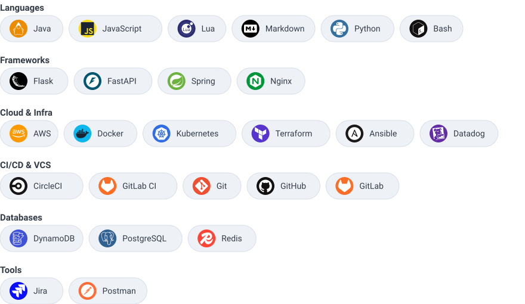

# 💫 About Me:
Senior DevOps Engineer with 6+ years building cloud infrastructure, platform reliability, and large-scale automation. Deep in AWS, Kubernetes, Docker, Terraform, and CI/CD — IaC, cost optimization, security-hardening, and high-availability architecture for SaaS and data-intensive systems.

- 🔭 Currently: Senior DevOps Engineer at Tech Prescient (client: Teikametrics) — EKS, Terraform GitOps via Argo Workflows/Events, Aurora PostgreSQL, sharded Redis/Valkey
- 🌱 Background: CI/CD, Kubernetes security (OPA, IAST), and Spring Boot microservices from Infosys/EdgeVerve
- 🎓 B.Tech Computer Science, SRM Institute of Science & Technology

## 🌐 Socials:
  

# 💻 Tech Stack:
<picture>
  <source media="(prefers-color-scheme: dark)" srcset="assets/tech-stack-dark.svg">
  <source media="(prefers-color-scheme: light)" srcset="assets/tech-stack-light.svg">
  
</picture>

# 🐍 Contribution Activity:
<picture>
  <source media="(prefers-color-scheme: dark)" srcset="assets/tech-snake-dark.svg">
  <source media="(prefers-color-scheme: light)" srcset="assets/tech-snake-light.svg">
  
</picture>

---

<!-- Proudly created with GPRM ( https://gprm.itsvg.in ) -->